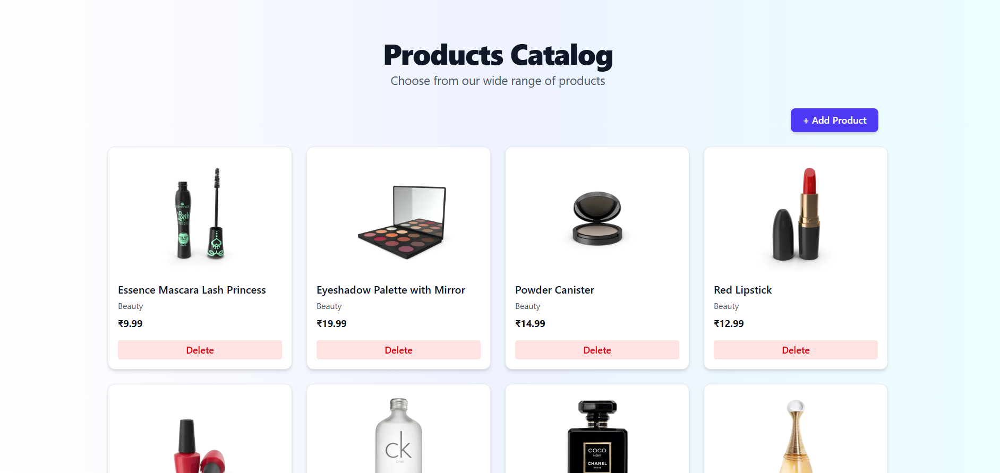
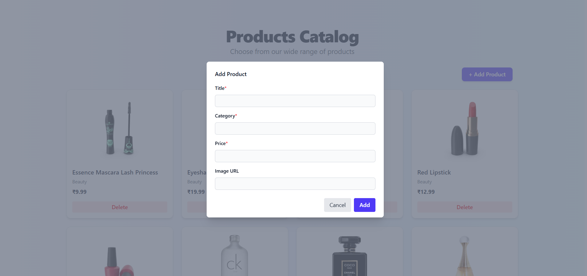
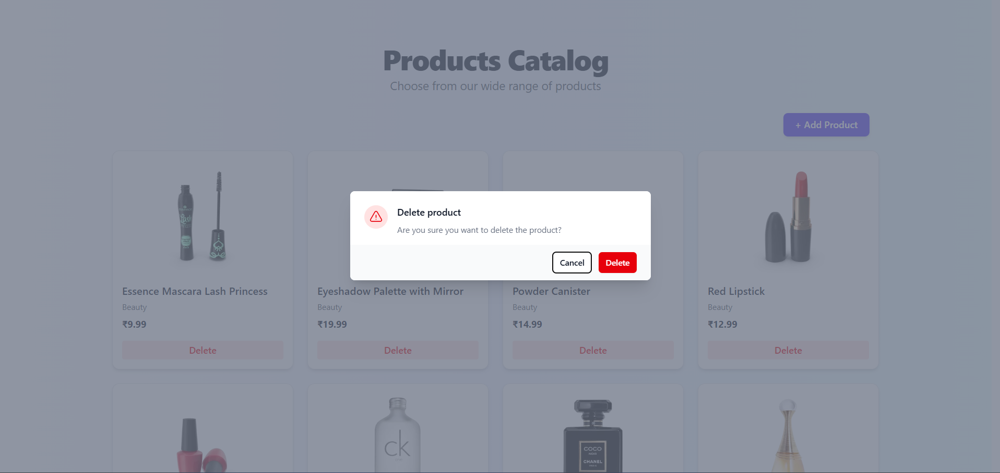
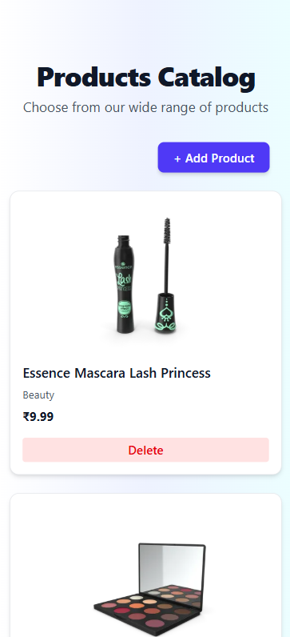

# 🛒 Product Catalog - React CRUD App

This is a simple responsive product catalog web app built with **React**, **Vite**, **TailwindCSS**, and **React Hook Form**. It supports basic **CRUD operations** (Create, Read, and Delete) using **dummyJSON API** and showcases features like lazy loading, modals with animations, form validation, and toast notifications.

---

## ✨ Features

- 📦 Fetch and display product list using cards
- ➕ Add a new product using a modal form (with validation)
- ❌ Delete products with confirmation modal
- 📱 Responsive card layout
- 🧠 Lazy loading with animation on scroll
- 🛠️ Modern UI using TailwindCSS
- 📢 Toast notifications for feedback
- 🧪 Loader while fetching data
- ⚙️ Axios for API calls

---

## 🖼️ Screenshots

> Add your screenshots below

- 📸 **Home Page:**  
  _

- 📸 **Add Product Modal:**  
  _

- 📸 **Delete Confirmation:**  
  _

- 📸 **Mobile View:**  
  _

---

## 🚀 Technologies Used

| Tech              | Description                     |
|------------------|---------------------------------|
| React + Vite     | Frontend framework + bundler    |
| TailwindCSS      | Utility-first CSS framework     |
| Headless UI      | Accessible UI components        |
| Heroicons        | Icon set used in forms/modals   |
| React Hook Form  | Forms and validation handling   |
| React Hot Toast  | Toast notifications             |
| Axios            | API handling                    |
| DummyJSON API    | Mock API for CRUD operations    |
| Framer Motion    | Animations (lazy loading cards) |

---


## 🛠️ Getting Started

Follow these steps to set up and run the project locally.

### 1. **Clone the Repository**
```bash
git clone https://github.com/Subham-Dass/CardX.git
cd CardX
```

### 2. **Install Dependencies**
```bash
npm install
```

### 3. **Start the Development Server**
```bash
npm run dev
```

Visit: http://localhost:5173

---

## 🏗️ Build for Production

### **To generate an optimized production build:**
```bash
npm run build
```

### **To preview the build locally:**
```bash
npm run preview
```

---

## 📌 Notes

Add Product uses a dummy POST request — data is not saved persistently.

Default image is used if no image URL is entered.

---


## 🧪 To-Do / Improvements

Update feature: Edit existing product

Search/filter functionality

Pagination for long lists

---


# 🧑‍💻 Author
Subham Das
GitHub
📫 Contact: [dassubham3007@gmail.com]